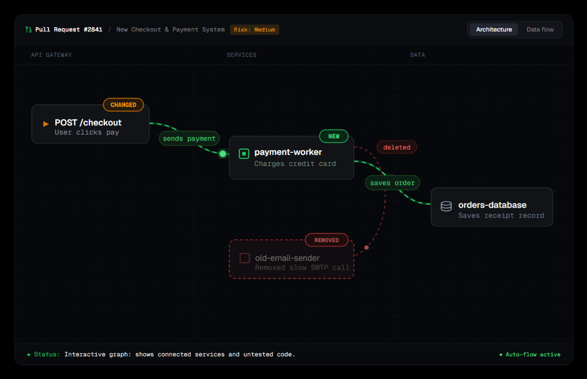
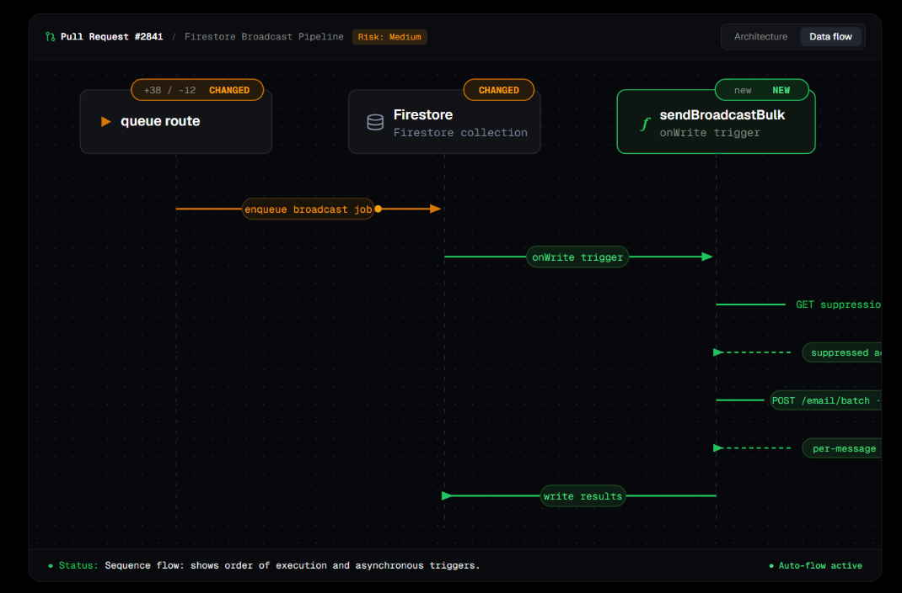

# Contour

> Automated architecture diagrams for every pull request — powered by AI.

[](LICENSE) [](https://github.com/Abrar090909/Github-PR-reviewer/actions/workflows/ci.yml) [](https://contour-wheat.vercel.app)

Contour reads your pull request diff and posts a visual dependency graph as a GitHub comment — showing exactly what changed, what it connects to, and where the risk is. No config files. No model keys to manage. Just install and review.

---

## Screenshots

**Architecture view** — which services, APIs, and data stores are affected, with change indicators on every node.



**Data flow view** — the sequence of calls and async triggers through your system end-to-end.



---

## How it works

1. A PR is opened, reopened, or updated with a new commit
2. Contour fetches the diff using a short-lived installation token
3. The LLM analyzes the diff and produces a structured `GraphDocument`
4. The SVG renderer produces light and dark theme diagrams
5. A single PR comment is created — or updated in-place on subsequent pushes

---

## Monorepo structure

```
apps/
  web/          → Hosted app — landing page + webhook API (Next.js 15)

packages/
  schema/       → Zod contracts — GraphDocument, PatchDocument, RenderManifest
  renderer/     → SVG diagram engine (layout algorithm + SVG painter)
  cli/          → Local analysis and rendering CLI
  action/       → Self-hosted GitHub Action entry point
```

---

## Hosted GitHub App (zero-config)

Repository owners install Contour once, select repositories, and every PR is analyzed automatically. No workflow to commit, no model key to provision.

**→ [Install at contour-wheat.vercel.app](https://contour-wheat.vercel.app)**

See [HOSTED_APP_SETUP.md](HOSTED_APP_SETUP.md) for the full deployment and GitHub App registration guide.

---

## Self-hosted GitHub Action

For teams that want to run Contour in their own CI with their own model key.

**Add to your workflow:**

```yaml
permissions:
  contents: write
  pull-requests: write

steps:
  - uses: actions/checkout@v4
    with:
      fetch-depth: 0

  - uses: Abrar090909/Github-PR-reviewer/packages/action@master
    with:
      api-key: ${{ secrets.GEMINI_API_KEY }}
```

**Use OpenAI or another provider:**

```yaml
  - uses: Abrar090909/Github-PR-reviewer/packages/action@master
    with:
      provider: openai
      model: gpt-4o
      base-url: https://api.openai.com/v1
      api-key: ${{ secrets.OPENAI_API_KEY }}
```

See [packages/action/README.md](packages/action/README.md) for the complete reference.

---

## Local development

```bash
# Install dependencies
pnpm install

# Start the Next.js landing page
pnpm dev          # → http://localhost:3000

# Type-check, lint, and test
pnpm typecheck
pnpm lint
pnpm test

# Build all packages
pnpm build
```

**Analyze a PR locally:**

```bash
pnpm --filter @contour/cli build

node packages/cli/dist/bin.js analyze \
  --base <base-sha> \
  --head <head-sha> \
  --provider gemini \
  --api-key-env GEMINI_API_KEY \
  --out /tmp/contour/graph.json

node packages/cli/dist/bin.js render /tmp/contour/graph.json \
  --out /tmp/contour/assets
```

---

## Tech stack

| Layer | Technology |
|---|---|
| Language | TypeScript |
| Web app | Next.js 15 (App Router) |
| Build system | Turborepo + pnpm workspaces |
| Schema | Zod |
| Diagram engine | Custom SVG layout + painter |
| LLM backends | Gemini · OpenAI · Anthropic (pluggable) |
| Database | Supabase (Postgres) |
| Queue | Upstash QStash |
| Cache | Upstash Redis |
| Deployment | Vercel |

---

## License

[MIT](LICENSE)
